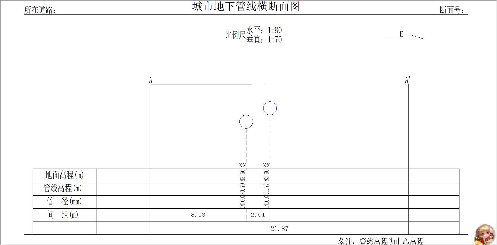
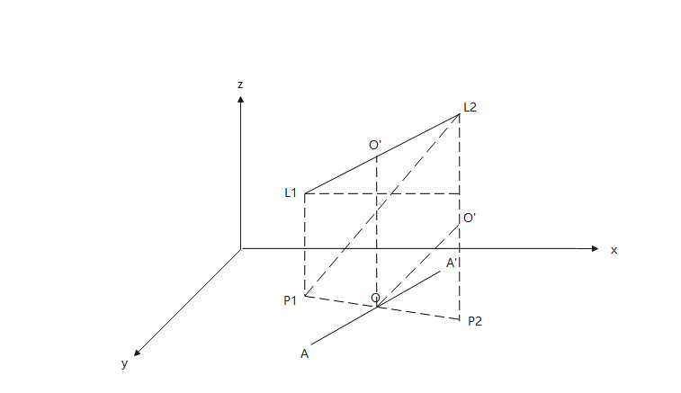

<html>
<head>
    <meta charset="UTF-8">
<title>
地下管网地理信息系统汇总
</title>
</head>
<body>
<h1 align="center">地下管网地理信息系统汇总</h1>
<h1>1.问题</h1>
<h2>埋设方式与管类型的关系 断面类型(0为圆管,1为方管) lsdjnvoihjf890234865</h2>
if (tGxAnaInfo.DType == "直埋") 
tGxAnaInfo.DmType = 0; 
else 
tGxAnaInfo.DmType = 1; 
<h2>方管与圆管管径存储方式的区别是什么 dkhnd9762650shctri</h2>
<h2>横剖面分析中的距离计算的是管线在xy平面投影的长度，需要确认一下横剖面分析里的间距是否是这个值 sdkhfxvhujf92374682394hxid</h2>
<h2>求管径的算法不一致，冗余  jxhfleinxv89236xhchd 与 jvjuhx[];.'1283 </h2>
<h2>判断管网是否为排水的方法不一致，并且通过编码常量来定义，不支持后期改动 klnfhfkjebr824649123 与 sjdfhioxhgdksdjfh</h2>
<h2>枚举类型是否应该确定到具体类型，else之后是有很多类型的 sdhfhxfdj2384675239hxdfg</h2>
<h2>水平净距中求两个几何对象的最小距离,求得是几何对象在xy平面投影的最小距离，理论上是不正确的</h2>
double shortestDistance = (pPolyLine1 as IProximityOperator).ReturnDistance(pPolyLine2 as IGeometry); 

<h1>2.公式 使用线表数据进行计算 管线相关</h1>

<h2>线表</h2>
<ul>
    <li>起点埋深</li>
    给水埋深 到管顶 
    排水埋深 到管底（内壁） 
    <li>终点埋深</li>
    <li>起点高程=起点地面高程(点表)-起点埋深</li>
    <li>终点高程=终点地面高程(点表)-终点埋深</li>
</ul>
<h2>点表</h2>
<ul>
    <li>地面高程</li>
</ul>

<h2>起点地面高程=起点高程+起点埋深</h2>
<h2>终点地面高程=终点高程+终点埋深</h2>

<h2>如果埋设方式为直埋，则断面类型为圆管，否则为方管。</h2>
圆管直径=圆管垂直管径*0.001 
方管管径去字段值的第一个数字值*0.001 
if (LSGOGisComFun.IsDoubleNumeric(tGxAnaInfo.Ds) == true) 
{ 
tGxAnaInfo.Ds1 = double.Parse(tGxAnaInfo.Ds); 
sngDs = tGxAnaInfo.Ds1 * 0.001; 
} 
else 
{ 
//dkhnd9762650shctri 
tGxAnaInfo.Ds2 = double.Parse(GetSquPipeDia(tGxAnaInfo.Ds)); 
sngDs = tGxAnaInfo.Ds2 * 0.001; 
} 

<h2>排水: xkbkfhiughdf9871265h</h2>
<h3>管线起点管底高程=起点高程</h3>
<h3>管线终点管底高程=终点高程</h3>
<h3>管线起点管顶高程=管线起点管底高程+直径</h3>
<h3>管线终点管顶高程=管线终点管底高程+直径</h3>

<h2>非排水：</h2>
<h3>管线起点管底高程=起点高程-直径</h3>
<h3>管线终点管底高程=终点高程-直径</h3>
 
<h3>管线起点中心高程=(起点高程+管线起点管底高程)/2</h3>
<h3>管线终点中心高程=(终点高程+管线终点管底高程)/2</h3>

<li></li>
<li></li>
<h3>管线起点到交点的距离</h3>
CrsToP1 = Math.Sqrt(Math.Pow(tGxAnaInfo.CrsX - dX1, 2) + Math.Pow(tGxAnaInfo.CrsY - dY1, 2));
<h3>管线长度</h3>
P1ToP2 = Math.Sqrt(Math.Pow(dX1 - dX2, 2) + Math.Pow(dY1 - dY2, 2));
<h3>管线断点处中心高程</h3>
tGxAnaInfo.CrsCenH = (tGxAnaInfo.CenH2 - tGxAnaInfo.CenH1) * CrsToP1 / P1ToP2 + tGxAnaInfo.CenH1;
<h3>断点处管顶高程=断点中心点高程+半径</h3>
tGxAnaInfo.CrsTopH = tGxAnaInfo.CrsCenH + sngDs * 0.5;
<h3>断点处管底高程=断点中心点高程-半径</h3>
tGxAnaInfo.CrsBtmH = tGxAnaInfo.CrsCenH - sngDs * 0.5;
<h3>管线断点处地面高程</h3>
tGxAnaInfo.CrsSurfH = (tGxAnaInfo.SurfH2 - tGxAnaInfo.SurfH1) * CrsToP1 / P1ToP2 + tGxAnaInfo.SurfH1;
<h3>管线断点处中心埋深=管线断点处地面高程-管线断点处中心高程</h3>
tGxAnaInfo.CrsCenDeep = tGxAnaInfo.CrsSurfH - tGxAnaInfo.CrsCenH;
<h3>管线断点处管顶埋深=管线断点处地面高程-管线断点处管顶高程</h3>
tGxAnaInfo.CrsTopDeep = tGxAnaInfo.CrsSurfH - tGxAnaInfo.CrsTopH;
<h3>管线断点处管底埋深=管线断点处地面高程-管线断点处管底高程</h3>
tGxAnaInfo.CrsBtmDeep = tGxAnaInfo.CrsSurfH - tGxAnaInfo.CrsBtmH;

</body>
</html>